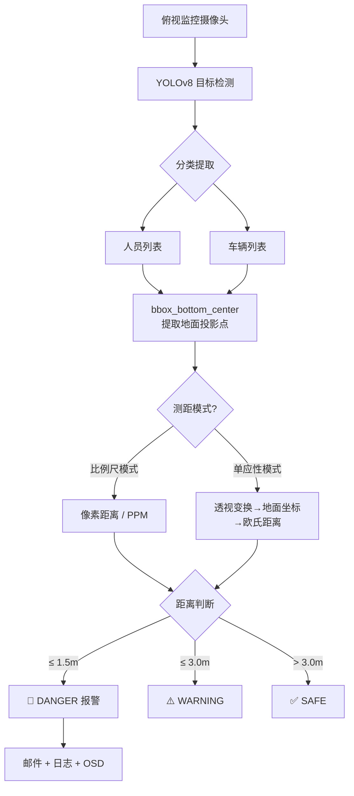

# 人车互斥系统 - 新增测距报警功能方案（v2）

在现有基础上新建代码，见底部，加入**单目测距算法**，当人与叉车的**实际距离 ≤ 1.5 米**时触发报警。

---

## 场景约束

> [!IMPORTANT]
> 相机**固定安装在工厂顶部**（俯视视角），目标在画面中呈**俯视投影**，不是直立姿态。  
> 因此原方案"基于目标高度的相似三角形测距"**不适用**，需改用**地面平面映射方案**。

---

## 测距方案修订

### 方案对比（俯视场景）

| 方案 | 原理 | 优点 | 缺点 | 推荐 |
|------|------|------|------|------|
| ~~A. 相似三角形~~ | ~~目标像素高度反推深度~~ | — | ❌ 俯视下 bbox 高度 ≠ 身高 | 不适用 |
| **B. 像素-米比例尺** | 俯视画面中像素距离 ∝ 真实距离，标定一个 `px_per_meter` 比例系数 | 极简、快速、无需额外模型 | 仅在近似正下方俯视 + 地面平坦时精确 | ⭐⭐⭐⭐ |
| **C. 单应性矩阵 (Homography)** | 用 4 个地面标定点建立像素↔地面坐标的映射矩阵 | 精度高、可校正倾斜/畸变 | 需要一次性标定 4 个点的真实坐标 | ⭐⭐⭐⭐⭐ |

### 推荐：同时支持方案 B 和 C

代码中同时实现两种模式，通过配置参数切换：

- **简易模式 (B)**：用户只需提供一个 `PIXELS_PER_METER` 值，即可快速上手
- **精准模式 (C)**：用户提供 4 个标定点坐标后，自动计算单应性矩阵，精度更高

---

## 测距算法原理

### 方案 B — 像素/米 比例尺（简易模式）

俯视摄像头下，地面近似为一个平面，像素距离与真实距离近似线性关系：

```text
真实距离(m) = 像素距离(px) / PIXELS_PER_METER
```

> [!TIP]
> **标定方法**：在地面上放两个标记物，间隔已知距离（如 2m），在画面中量出像素间距，即可计算 `PIXELS_PER_METER`。

### 方案 C — 单应性矩阵（精准模式）

使用 OpenCV `cv2.getPerspectiveTransform()` 或 `cv2.findHomography()`：

1. **选定 4 个地面标定点**，记录其像素坐标 （米）
2. 计算单应性矩阵 `H`
3. 运行时将 bbox 底部中心点通过 `H` 变换到地面坐标系
4. 在地面坐标系中计算人车**欧氏距离**

```text
[X]       [u]
[Y] = H × [v]
[1]       [1]
```

> [!NOTE]
> 俯视摄像头的 **bbox 底部中心** 近似为目标脚底在地面的投影位置，比 bbox 中心更准确。

---

## 关键参数配置

| 参数 | 含义 | 默认值 | 说明 |
|------|------|--------|------|
| `DISTANCE_MODE` | 测距模式 | `"scale"` | `"scale"` = 比例尺模式，`"homography"` = 单应性矩阵模式 |
| `PIXELS_PER_METER` | 像素/米比例 | `100.0` | 简易模式使用，需实际标定 |
| `CALIB_PIXEL_POINTS` | 标定像素坐标 | 4 个点 | 精准模式使用 |
| `CALIB_REAL_POINTS` | 标定真实坐标(米) | 4 个点 | 精准模式使用 |
| `ALARM_DISTANCE_M` | 报警阈值 | `1.5` | ≤ 1.5m → DANGER |
| `WARNING_DISTANCE_M` | 预警阈值 | `3.0` | ≤ 3.0m → WARNING |

---


## 架构图



---

## 验证计划

### 代码检查
- `python -c "import ast; ast.parse(open('final_distance.py').read())"` 确认语法无误

### 手动验证
1. 在工厂地面用**已知距离**的标记物标定 `PIXELS_PER_METER`
2. 让人站在叉车前 ~1m / ~2m / ~4m 处，观察画面显示的距离值和报警状态
3. 根据偏差调整参数

> [!TIP]
> 如果精度不够，可切换到 `"homography"` 模式，用地面 4 个参考点标定。


# 代码
```text
import cv2
import math
import time
import json
import os
import numpy as np
from datetime import datetime
from ultralytics import YOLO
import yagmail
import paho.mqtt.client as mqtt


# ============================================================
# 邮件配置
# ============================================================

EMAIL_SETTING = {
    "smtp_server": "smtp.qq.com",
    "sender": os.getenv("ALARM_EMAIL_SENDER"),
    "auth_code": os.getenv("ALARM_EMAIL_AUTH"),
    "receivers": os.getenv("ALARM_EMAIL_RECEIVERS", "").split(",")
}


# ============================================================
# 报警配置
# ============================================================

ALARM_SETTING = {
    "log_file": "vehicle_person_alarm.log",
    "cool_down": 10
}

LAST_ALARM = {}


# ============================================================
# 测距配置
# ============================================================

# 测距模式: "scale" = 像素/米比例尺模式, "homography" = 单应性矩阵模式
DISTANCE_MODE = "scale"

# --- 模式 A: 比例尺模式 ---
# 每米对应的像素数量（需要根据实际场景标定）
# 标定方法：在地面放两个标记物，间隔已知距离(如2m)，量出像素间距，除以距离即可
PIXELS_PER_METER = 100.0

# --- 模式 B: 单应性矩阵模式 ---
# 4 个标定点的像素坐标 (u, v)
# 需要根据实际场景标定：在地面选 4 个参考点，记录其像素坐标和真实地面坐标
CALIB_PIXEL_POINTS = np.float32([
    [100, 100],   # 标定点1 像素坐标
    [540, 100],   # 标定点2 像素坐标
    [100, 380],   # 标定点3 像素坐标
    [540, 380],   # 标定点4 像素坐标
])

# 4 个标定点对应的真实地面坐标 (X, Y)，单位：米
CALIB_REAL_POINTS = np.float32([
    [0.0, 0.0],   # 标定点1 真实坐标
    [5.0, 0.0],   # 标定点2 真实坐标
    [0.0, 3.0],   # 标定点3 真实坐标
    [5.0, 3.0],   # 标定点4 真实坐标
])

# --- 距离阈值 ---
ALARM_DISTANCE_M = 1.5    # ≤ 1.5m 触发 DANGER
WARNING_DISTANCE_M = 3.0  # ≤ 3.0m 触发 WARNING


# ============================================================
# 系统状态
# ============================================================

class SystemState:
    SAFE = 0
    WARNING = 1
    DANGER = 2

STATE_COLOR = {
    SystemState.SAFE: (0, 255, 0),      # 绿色
    SystemState.WARNING: (0, 255, 255),  # 黄色
    SystemState.DANGER: (0, 0, 255)      # 红色
}

STATE_TEXT = {
    SystemState.SAFE: "SAFE",
    SystemState.WARNING: "WARNING",
    SystemState.DANGER: "DANGER"
}


# ============================================================
# 报警模块（与 final.py 保持一致）
# ============================================================

def write_alarm_log(camera_id: str, detail: str, email_ok: bool):
    """写入告警日志到本地文件"""
    log_info = {
        "camera_id": camera_id,
        "alarm_type": "人车互斥",
        "alarm_time": datetime.now().strftime("%Y-%m-%d %H:%M:%S"),
        "detail": detail,
        "email_send_success": email_ok
    }
    with open(ALARM_SETTING["log_file"], "a", encoding="utf-8") as f:
        f.write(json.dumps(log_info, ensure_ascii=False) + "\n")
    print(f"[日志] 已记录 {camera_id} 告警")

def send_alarm_email(camera_id: str, detail: str) -> bool:
    """发送告警邮件，最多重试3次"""
    subject = f"【人车互斥告警】{camera_id} 风险触发"
    content = f"""
告警时间：{datetime.now().strftime("%Y-%m-%d %H:%M:%S")}
摄像头编号：{camera_id}
告警详情：{detail}
处理建议：请立即核查现场，避免碰撞事故
—— 大创人车互斥系统
"""
    try:
        client = yagmail.SMTP(
            user=EMAIL_SETTING["sender"],
            password=EMAIL_SETTING["auth_code"],
            host=EMAIL_SETTING["smtp_server"],
            port=465,
            smtp_ssl=True
        )
    except Exception as e:
        print(f"[邮箱错误] 初始化失败：{e}")
        return False

    for i in range(3):
        try:
            client.send(
                to=EMAIL_SETTING["receivers"],
                subject=subject,
                contents=content
            )
            print("[邮箱成功] 告警邮件已发送")
            return True
        except Exception as e:
            print(f"[邮箱重试] 第{i+1}次失败：{e}")
            time.sleep(2)
    return False

def trigger_vehicle_person_alarm(camera_id: str, detail: str):
    """触发报警：检查冷却时间，发送邮件并记录日志"""
    now = time.time()
    if camera_id in LAST_ALARM:
        if now - LAST_ALARM[camera_id] < ALARM_SETTING["cool_down"]:
            print(f"[冷却] {camera_id} 冷却中，跳过告警")
            return

    LAST_ALARM[camera_id] = now
    email_ok = send_alarm_email(camera_id, detail)
    write_alarm_log(camera_id, detail, email_ok)


# ============================================================
# 测距工具函数
# ============================================================

def bbox_bottom_center(bbox):
    """
    取 bbox 底部中心点作为目标在地面的投影位置。
    俯视摄像头下，底部中心 ≈ 目标脚底/底盘在地面的投影。
    bbox 格式: [x1, y1, x2, y2]
    """
    x1, y1, x2, y2 = bbox
    return ((x1 + x2) / 2, y2)


def bbox_center(bbox):
    """取 bbox 中心点（备用，部分场景可能更合适）"""
    x1, y1, x2, y2 = bbox
    return ((x1 + x2) / 2, (y1 + y2) / 2)


def pixel_distance(p1, p2):
    """计算两点之间的像素欧氏距离"""
    return math.hypot(p1[0] - p2[0], p1[1] - p2[1])


def compute_homography_matrix():
    """
    根据标定点计算单应性矩阵 H。
    H 将像素坐标 (u, v) 映射到地面真实坐标 (X, Y)。
    """
    H = cv2.getPerspectiveTransform(CALIB_PIXEL_POINTS, CALIB_REAL_POINTS)
    return H


def pixel_to_ground(point, H):
    """
    使用单应性矩阵将像素坐标变换到地面坐标。
    point: (u, v) 像素坐标
    H: 3x3 单应性矩阵
    返回: (X, Y) 地面真实坐标（米）
    """
    pt = np.float32([[point[0], point[1]]]).reshape(-1, 1, 2)
    transformed = cv2.perspectiveTransform(pt, H)
    return (transformed[0][0][0], transformed[0][0][1])


def estimate_distance_scale(person_bbox, vehicle_bbox):
    """
    比例尺模式：通过 像素距离 / PIXELS_PER_METER 计算真实距离。
    适用于近似正下方俯视 + 地面平坦的场景。
    """
    p1 = bbox_bottom_center(person_bbox)
    p2 = bbox_bottom_center(vehicle_bbox)
    d_pixel = pixel_distance(p1, p2)
    d_real = d_pixel / PIXELS_PER_METER
    return d_real, p1, p2


def estimate_distance_homography(person_bbox, vehicle_bbox, H):
    """
    单应性矩阵模式：将 bbox 底部中心变换到地面坐标系后计算欧氏距离。
    精度更高，可校正倾斜和畸变。
    """
    p1_pixel = bbox_bottom_center(person_bbox)
    p2_pixel = bbox_bottom_center(vehicle_bbox)

    # 变换到地面真实坐标
    p1_ground = pixel_to_ground(p1_pixel, H)
    p2_ground = pixel_to_ground(p2_pixel, H)

    # 地面坐标系中的欧氏距离
    d_real = math.hypot(p1_ground[0] - p2_ground[0], p1_ground[1] - p2_ground[1])
    return d_real, p1_pixel, p2_pixel


def compute_real_distance(person_bbox, vehicle_bbox, H=None):
    """
    统一测距入口：根据 DISTANCE_MODE 选择测距方法。
    返回: (真实距离_米, 人地面投影点_像素, 车地面投影点_像素)
    """
    if DISTANCE_MODE == "homography" and H is not None:
        return estimate_distance_homography(person_bbox, vehicle_bbox, H)
    else:
        return estimate_distance_scale(person_bbox, vehicle_bbox)


# ============================================================
# 互斥模型（基于真实距离）
# ============================================================

def mutual_exclusion_model(person_bbox, vehicle_bbox, H=None):
    """
    基于真实距离（米）的人车互斥判定模型。
    替代原 final.py 中基于像素伪距离的判定。
    返回: (真实距离, 风险等级, 人投影点, 车投影点)
    """
    d_real, p1, p2 = compute_real_distance(person_bbox, vehicle_bbox, H)

    if d_real <= ALARM_DISTANCE_M:
        state = SystemState.DANGER
    elif d_real <= WARNING_DISTANCE_M:
        state = SystemState.WARNING
    else:
        state = SystemState.SAFE

    return d_real, state, p1, p2


# ============================================================
# 主程序
# ============================================================

if __name__ == "__main__":
    # ================= MQTT 客户端 =================
    MQTT_BROKER = "localhost"
    MQTT_PORT = 1883
    DEVICE_ID = "FORK-001"
    MQTT_TOPIC = f"factory/forklift/{DEVICE_ID}/alarm"

    mqtt_client = mqtt.Client()
    mqtt_client.connect(MQTT_BROKER, MQTT_PORT, 60)
    mqtt_client.loop_start()
    print("[MQTT] 已连接到 Broker")

    # 加载 YOLOv8 模型
    model = YOLO("yolov8n.pt")

    # 打开摄像头
    cap = cv2.VideoCapture(0, cv2.CAP_DSHOW)
    camera_id = "CAM_01"

    # 如果使用单应性矩阵模式，预先计算 H
    H = None
    if DISTANCE_MODE == "homography":
        H = compute_homography_matrix()
        print("[初始化] 单应性矩阵已计算完成")
    else:
        print(f"[初始化] 比例尺模式，PIXELS_PER_METER = {PIXELS_PER_METER}")

    print(f"[初始化] 报警阈值: {ALARM_DISTANCE_M}m | 预警阈值: {WARNING_DISTANCE_M}m")
    print("[运行中] 按 'q' 退出程序")

    while True:
        ret, frame = cap.read()
        if not ret:
            break

        # YOLOv8 推理
        results = model(frame)[0]

        # 分类提取人员和车辆
        persons = []
        vehicles = []

        for box in results.boxes:
            cls_id = int(box.cls[0])
            cls_name = model.names[cls_id]
            bbox = box.xyxy[0].tolist()

            if cls_name == "person":
                persons.append({"bbox": bbox})
            elif cls_name in ["truck", "car", "bus"]:
                vehicles.append({"bbox": bbox})

        # 对每一对人-车进行测距判断
        for i, p in enumerate(persons):
            for j, v in enumerate(vehicles):
                d_real, state, pt_person, pt_vehicle = mutual_exclusion_model(
                    p["bbox"], v["bbox"], H
                )

                # 危险状态触发报警
                if state == SystemState.DANGER:
                    detail = (
                        f"人员{i} 与车辆{j} 实际距离 {d_real:.2f}m，"
                        f"低于安全阈值 {ALARM_DISTANCE_M}m"
                    )
                    trigger_vehicle_person_alarm(camera_id, detail)
                     # ===== MQTT 上报 =====
                    payload = {
                         "device_id": DEVICE_ID,
                         "alarm": 1,
                         "driver_present": 1,
                         "outer_intrusion": 1,
                         "timestamp": datetime.now().strftime("%Y-%m-%d %H:%M:%S")
                    }

                    mqtt_client.publish(MQTT_TOPIC, json.dumps(payload), qos=1)
                    print("[MQTT] 已发布报警")

                # ---- 可视化 ----

                # 绘制人员 bbox（绿色）
                px1, py1, px2, py2 = map(int, p["bbox"])
                cv2.rectangle(frame, (px1, py1), (px2, py2), (0, 255, 0), 2)
                cv2.putText(
                    frame, f"Person {i}",
                    (px1, py1 - 5),
                    cv2.FONT_HERSHEY_SIMPLEX, 0.5, (0, 255, 0), 1
                )

                # 绘制车辆 bbox（颜色随状态变化）
                vx1, vy1, vx2, vy2 = map(int, v["bbox"])
                color = STATE_COLOR[state]
                cv2.rectangle(frame, (vx1, vy1), (vx2, vy2), color, 2)

                # 在车辆上方显示状态文字
                cv2.putText(
                    frame, STATE_TEXT[state],
                    (vx1, vy1 - 25),
                    cv2.FONT_HERSHEY_SIMPLEX, 0.7, color, 2
                )

                # 在车辆上方显示距离
                cv2.putText(
                    frame, f"{d_real:.2f}m",
                    (vx1, vy1 - 5),
                    cv2.FONT_HERSHEY_SIMPLEX, 0.6, color, 2
                )

                # 绘制人-车之间的连线（从各自底部中心点出发）
                pt_p = (int(pt_person[0]), int(pt_person[1]))
                pt_v = (int(pt_vehicle[0]), int(pt_vehicle[1]))
                cv2.line(frame, pt_p, pt_v, color, 2)

                # 在连线中点显示距离值
                mid_x = (pt_p[0] + pt_v[0]) // 2
                mid_y = (pt_p[1] + pt_v[1]) // 2
                cv2.putText(
                    frame, f"{d_real:.2f}m",
                    (mid_x + 5, mid_y - 5),
                    cv2.FONT_HERSHEY_SIMPLEX, 0.6, (255, 255, 255), 2
                )

        # 在画面左上角显示模式信息
        mode_text = f"Mode: {DISTANCE_MODE} | Alarm: {ALARM_DISTANCE_M}m"
        cv2.putText(
            frame, mode_text,
            (10, 25),
            cv2.FONT_HERSHEY_SIMPLEX, 0.6, (255, 255, 255), 1
        )

        cv2.imshow("Human-Vehicle Exclusion System (Distance)", frame)

        if cv2.waitKey(1) & 0xFF == ord("q"):
            break

    cap.release()
    cv2.destroyAllWindows()
```
