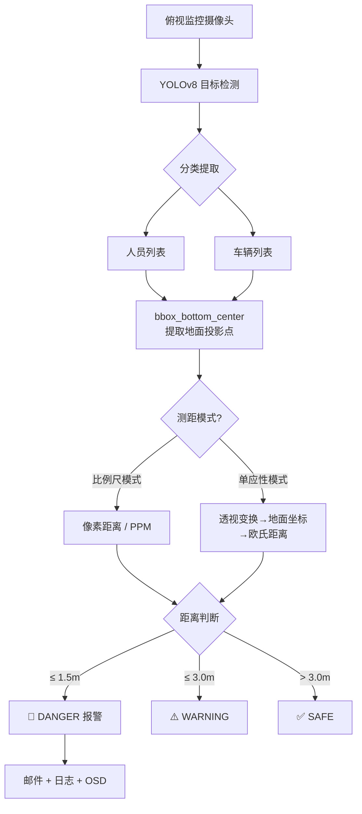

# 人车互斥系统 - 新增测距报警功能方案（v2）

在现有 [final.py](file:///c:/Users/a2719/Desktop/human-vehicle-exclusion-main/final.py) 基础上新建 `final_distance.py`，加入**单目测距算法**，当人与叉车的**实际距离 ≤ 1.5 米**时触发报警。

---

## 场景约束

> [!IMPORTANT]
> 相机**固定安装在工厂顶部**（俯视视角），目标在画面中呈**俯视投影**，不是直立姿态。  
> 因此原方案"基于目标高度的相似三角形测距"**不适用**，需改用**地面平面映射方案**。

---

## 测距方案修订

### 方案对比（俯视场景）

| 方案 | 原理 | 优点 | 缺点 | 推荐 |
|------|------|------|------|------|
| ~~A. 相似三角形~~ | ~~目标像素高度反推深度~~ | — | ❌ 俯视下 bbox 高度 ≠ 身高 | 不适用 |
| **B. 像素-米比例尺** | 俯视画面中像素距离 ∝ 真实距离，标定一个 `px_per_meter` 比例系数 | 极简、快速、无需额外模型 | 仅在近似正下方俯视 + 地面平坦时精确 | ⭐⭐⭐⭐ |
| **C. 单应性矩阵 (Homography)** | 用 4 个地面标定点建立像素↔地面坐标的映射矩阵 | 精度高、可校正倾斜/畸变 | 需要一次性标定 4 个点的真实坐标 | ⭐⭐⭐⭐⭐ |

### 推荐：同时支持方案 B 和 C

代码中同时实现两种模式，通过配置参数切换：

- **简易模式 (B)**：用户只需提供一个 `PIXELS_PER_METER` 值，即可快速上手
- **精准模式 (C)**：用户提供 4 个标定点坐标后，自动计算单应性矩阵，精度更高

---

## 测距算法原理

### 方案 B — 像素/米 比例尺（简易模式）

俯视摄像头下，地面近似为一个平面，像素距离与真实距离近似线性关系：

```text
真实距离(m) = 像素距离(px) / PIXELS_PER_METER
```

> [!TIP]
> **标定方法**：在地面上放两个标记物，间隔已知距离（如 2m），在画面中量出像素间距，即可计算 `PIXELS_PER_METER`。

### 方案 C — 单应性矩阵（精准模式）

使用 OpenCV `cv2.getPerspectiveTransform()` 或 `cv2.findHomography()`：

1. **选定 4 个地面标定点**，记录其像素坐标 [(u, v)](file:///c:/Users/a2719/Desktop/human-vehicle-exclusion-main/final.py#100-104) 和真实地面坐标 [(X, Y)](file:///c:/Users/a2719/Desktop/human-vehicle-exclusion-main/final.py#100-104) （米）
2. 计算单应性矩阵 `H`
3. 运行时将 bbox 底部中心点通过 `H` 变换到地面坐标系
4. 在地面坐标系中计算人车**欧氏距离**

```text
[X]       [u]
[Y] = H × [v]
[1]       [1]
```

> [!NOTE]
> 俯视摄像头的 **bbox 底部中心** 近似为目标脚底在地面的投影位置，比 bbox 中心更准确。

---

## 关键参数配置

| 参数 | 含义 | 默认值 | 说明 |
|------|------|--------|------|
| `DISTANCE_MODE` | 测距模式 | `"scale"` | `"scale"` = 比例尺模式，`"homography"` = 单应性矩阵模式 |
| `PIXELS_PER_METER` | 像素/米比例 | `100.0` | 简易模式使用，需实际标定 |
| `CALIB_PIXEL_POINTS` | 标定像素坐标 | 4 个点 | 精准模式使用 |
| `CALIB_REAL_POINTS` | 标定真实坐标(米) | 4 个点 | 精准模式使用 |
| `ALARM_DISTANCE_M` | 报警阈值 | `1.5` | ≤ 1.5m → DANGER |
| `WARNING_DISTANCE_M` | 预警阈值 | `3.0` | ≤ 3.0m → WARNING |

---

## 代码变更

### [NEW] [final_distance.py](file:///c:/Users/a2719/Desktop/human-vehicle-exclusion-main/final_distance.py)

基于 [final.py](file:///c:/Users/a2719/Desktop/human-vehicle-exclusion-main/final.py)，主要新增/修改：

1. **新增测距配置区**
   - `DISTANCE_MODE`、`PIXELS_PER_METER`、标定点、阈值等

2. **新增测距函数**
   - `bbox_bottom_center(bbox)` — 取 bbox 底部中心作为地面投影点
   - `pixel_to_ground(point, H)` — 像素坐标→地面真实坐标（单应性模式）
   - `estimate_distance_scale(p1, p2)` — 比例尺模式计算真实距离
   - `estimate_distance_homography(p1, p2, H)` — 单应性模式计算真实距离
   - `compute_real_distance(person, vehicle)` — 统一入口函数

3. **修改互斥模型**
   - 用**米为单位的真实距离**替代像素伪距离
   - 阈值：**1.5m (DANGER)** / **3.0m (WARNING)**

4. **增强 OSD**
   - 显示 `"距离: X.XX m"` 和风险等级
   - 使用 bbox 底部中心画连线，直观展示距离

5. **保留**原有邮件报警、日志、冷却机制

---

## 架构图



---

## 验证计划

### 代码检查
- `python -c "import ast; ast.parse(open('final_distance.py').read())"` 确认语法无误

### 手动验证
1. 在工厂地面用**已知距离**的标记物标定 `PIXELS_PER_METER`
2. 让人站在叉车前 ~1m / ~2m / ~4m 处，观察画面显示的距离值和报警状态
3. 根据偏差调整参数

> [!TIP]
> 如果精度不够，可切换到 `"homography"` 模式，用地面 4 个参考点标定。
